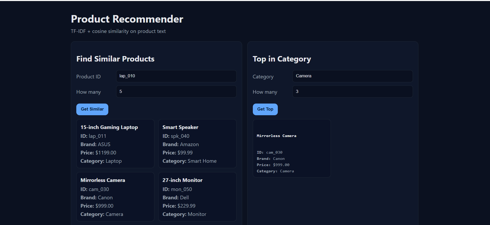

**Project main-idea**

A small Product Recommender that suggests similar items by analyzing product text (title, brand, features) with TF-IDF + cosine similarity, and exposes results through a tiny Flask API and web page. You can ask for “similar to tv_001” or “top in category TV,” and it returns clean JSON that the page renders as product cards.

# RetailMatch – Product Recommender System

A simple **Flask API** and **minimal web UI** for recommending similar products based on their descriptions.  
Uses **TF-IDF vectorization** and **cosine similarity** to compute word importance and match products.

---

## Features
**Text Preprocessing** – Cleans and tokenizes product descriptions for better similarity matching.
**TF-IDF Vectorization** – Calculates word importance across the dataset.
**Cosine Similarity** – Finds and ranks the most relevant products.
**Flask API** – Serves recommendation results through clean endpoints.
**Minimal Web Interface** – Allows users to interact with the recommender without coding.

---

## Tech Stack
- **Python 3.12**
- **Flask** (API framework)
- **Scikit-learn** (TF-IDF & cosine similarity)
- **Pandas** (data processing)
- **HTML/CSS + Jinja2** (UI rendering)

---

## Project Structure

---

## Getting Started

1️ Clone the Repository

git clone https://github.com/mabdelmalek-dev/RetailMatch.git
cd RetailMatch

2️ Create a Virtual Environment
python -m venv .venv

Windows:

.venv\Scripts\activate

Mac/Linux:

source .venv/bin/activate

3️ Install Dependencies
pip install -r requirements.txt

4️ Run the App
python src/app.py

5️ Open in Browser

Visit:

http://127.0.0.1:5000

Example Use

Select a Category (e.g., TV).

Choose How Many recommendations you want.

View Top Products based on similarity score.

Future Improvements

Add collaborative filtering (user behavior-based recommendations)

Use a larger retail dataset

Deploy to Heroku or Render for live demo

Author

Mohamed Abdelmalek
Email: [mabdelmalek.dev@gmail.com]
GitHub: mabdelmalek-dev

